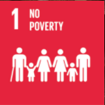
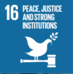

# Project Title: Analysis on Why Women and Children are Vulnerable for Human Trafficking in India Year 2019

**Introduction**

Human trafficking, sometimes known as modern-day slavery, is a multibillion-dollar form of international organized crime. It is illegal use of force, deception, or compulsion to gain labor or commercial sex acts. Victims might be of any age, ethnicity, gender, or nationality, and it can happen in any society. To attract victims into trafficking situations, traffickers may employ violence, manipulation, or false promises of well-paying jobs or personal relationships. To seduce their victims into work or commercial sexual exploitation, traffickers utilize force, deceit, or compulsion. They are looking for people who are vulnerable for a variety of reasons, such as psychological or emotional weakness, economic difficulty, a lack of social safety net, natural calamities, or political instability. Many victims may not recognize themselves as victims or seek aid, even in extremely public circumstances, due to the stress created by traffickers.
	India is the world's second-largest country, with a current population of 1.3 billion people. However, its magnitude brings a slew of human rights concerns. With so many people in one country, it's easy for many of them to slip through the cracks. Human trafficking is one of India's most serious human rights issues. According to a poll of global experts, India is the most dangerous country for women because of the high risk of sexual violence and being forced into slave labor (Thomson Reuters Foundation, 2018). It is also stated in National Crime Records Bureau that 33,855 people in India were victims of kidnapping for the purpose of marriage in 2016. Individuals under the age of 18 made up half of this percentage. The most popular methods used by kidnappers are commercial sex and indentured slavery. According to a UNODC survey from 2013, nine out of ten households in the Indian state of Haryana bought brides from destitute areas throughout the country. According to the report, the majority of the women were subjected to abuse, rape, and forced labor.	
  There are also child kidnappings occur alongside the women's trade. Kidnappers force many of the victims to work in the agricultural and manufacturing industries. According to India Today a popular news platform in India, it stated that in 2017, 26 kids went missing from the railway stations. Out of the 22 missing kids, 9 were abducted from the New Delhi Railway station while 8 of them were kidnapped from the Old Delhi station. The majority of these disappearances go unnoticed due to the station's hectic atmosphere. Because of poverty and violence at home, many of these children either live near the station or travel out to work despite the dangers and illegality of child labor. Despite being the world's largest democratic republic, India suffers from widespread poverty and a lack of sufficient education, leading to a slew of human rights violations, particularly against women, girls, and children. 
  Children are particularly vulnerable to human trafficking in countries that have a large number of children, specifically in India. This case is already a crisis in India. According to the Centre for Monitoring the Indian Economy, this crisis got worse due to the unemployment of 122 million people in India due to the impact of the COVID-19 pandemic. According to Neetah Lal, children are more vulnerable when their families are financially insecure. Traffickers prey on such vulnerable families by promising a new job, increased income, improved living conditions, and financial assistance. It's no surprise that child labor continues to thrive throughout large swaths of India, with industry studies estimating that over eight million youngsters aged five to 14 toil in fields, dangerous factories, shops, and homes.
  Aside from being vulnerable of the victims, there are some factors that motivate traffickers. According to India’s 2008 Integrated Plan of Action to Prevent and Combat Human Trafficking, the scale of the problem is enormous "both in [the] growing number of trafficked people and in the growing number of locations." Traffickers are motivated by high profits and a low risk of detection due to weak law enforcement and low levels of prosecution.
  Despite being the world's largest democratic republic, India suffers from widespread poverty and a lack of sufficient education, leading to a slew of human rights violations, particularly against women and girls. This study aims to discover why women and children are the most vulnerable for human trafficking, why people are being kidnapped and for what reason using the datasets that has been gathered ny the researchers. It contains victims that have been trafficked, gender, age/group,  and purpose of the trafficking 2019, 
  
  
  
**Problem Statement**

 Human Trafficking is not an easy topic and issue to begin with but for someone who has the control on power, money and law can easily outrun the truth and justice as much as its convenient to their advantages. Despite the fact that human trafficking is predominantly a transnational organized crime, India, like many other South Asian countries, is increasingly becoming a source, transit point, and destination for traffickers. The essence of the problem is that, because human trafficking is a very hidden and clandestine enterprise, it is mostly under-reported and untraced, despite various international initiatives urging governments to take action. As of today, the citizens of India face a great hindrance in attaining their rights and equal treatment as there are many variables that deny it. With that being said the lack of attention and strong punishment with the violators are one of the main problems that needs to be immediately addressed. 
Human trafficking is estimated to afflict between 20 and 65 million persons in India. Women and girls are transported inside the country for commercial sexual exploitation and forced marriage, particularly in locations where the gender ratio is heavily skewed toward men. A large number of youngsters are compelled to work as factory laborers, household servants, beggars, and farm labourers, while some are used as child soldiers by rebel or terrorist groups. India is the most unsafe country for women, according to a poll of worldwide experts, due to the high risk of sexual abuse and enslavement (Thomson Reuters Foundation, 2018). According to the Central Bureau of Investigation, 135,000 children in India are victims of human trafficking each year. This indicates that India's citizens and people are being violated against their wills, demonstrating how serious the situation is within the country's administration.
Despite being the world's largest democratic republic, India suffers from widespread poverty and a lack of sufficient education, which leads to a slew of human rights violations, particularly against women and girls.

**Objective of the Study**

 The objective of this study are:
 
i. To raise awareness that many people have been manipulated to do wrongdoings or have been abused because of human trafficking.

ii. To make recommendations for preventing human trafficking in India.

iii. To analyze the victims that have been trafficked, gender, age/group,  and purpose of the trafficking 2019, 

 

 **Methods**
 
This study will focus on data about the major factors of human trafficking. By creating a data analysis about the factors of human trafficking, the researchers are able to analyze the the information collected, evaluate and rank the factors of human trafficking. This study employs an analytical approach, that will able to breakdown the facts and information relevant to the study, and assisting the researchers in adding elements that reflect as a solution for the problem. Important and useful information was gathered from reliable sources or websites from the internet to examine and analyze factors related to human trafficking.
 
 
 
 **Expected Output**
 
The increasing number of human trafficking victims may lead into various crimes and a great barrier in attaining their social rights and equality. According to the UNODC website, human trafficking is considered as the second largest organised crime in India. Human trafficking is still a major issue in India, despite the fact that it is banned under Indian law. These study aims to produce an exploratory data analysis based from the data gathered from reliable websites containing informations about the cases of human trafficking in India. The data collected will be analyzed and be utilized to develop a human trafficking awareness campaign that can potentially help individuals especially women and children to be educate about their rights and to be aware about the effects of human trafficking to help reduce victimization within vulnerable populations especially India. 
 
 
 
 **Sustainable Development Goals (SDGs) of the Project**
 
  The SDGs that this project aims to accomplish are first no poverty, and second peace, justice, and strong institutions. 

The following are further definitions of the SDGs:

1.  **Goal 1 : No Poverty** - This SDG aims to end poverty in all its form everywhere (sdgs.un.org)

2.  **Goal 16: Peace, Justice and Strong Institutions** - This SDG aims to promote peaceful and inclusive societies for sustainable development, provide access to justice for all and build effective, accountable and iclusive institutions at all levels. (sdgs.un.org)

